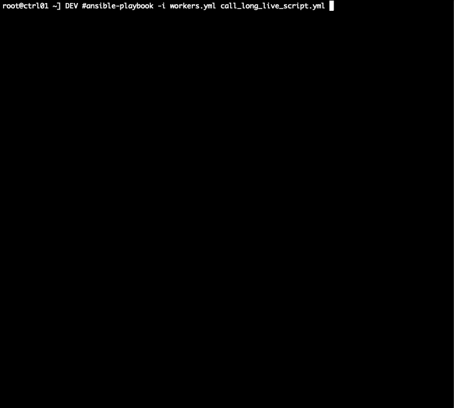

# remote_logging
Realtime log streams for Ansible

It works and tested with Ansible 2.7.10 only.

Copy files in _**ansible**_ folder to system ansible module location (backup the original files first).


```
- name: Run long live task
  hosts: worker01

  tasks:
  - shell_with_log: /root/sleep.sh
```


<figure>
  
  <figcaption>Example - one node</figcaption>
</figure>


<figure>
  
  <figcaption>Example - two nodes</figcaption>
</figure>

